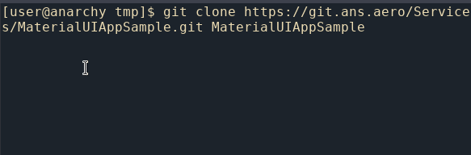
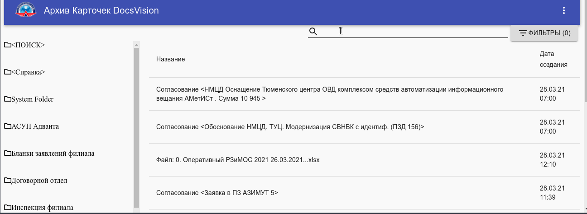

# Сбор планов расходов

### Установка ###
```
# Склонировать репозиторий
git clone git@github.com:ATMRussia/archiveDv.git archiveDv
# Перейте в каталог с программой и установить зависимости
cd archiveDv
npm install
# Собрать клиентский React код
npm run build
# Создать конфигурационный файл settings.js
# Создать индексы в БД
npm run idx
```



### Запуск ###
* Запуск приложения `npm start`
* Откройте страницу в браузере `http://127.0.0.1:3000`


